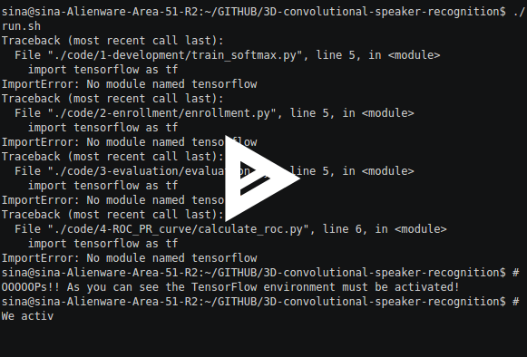

=============================================================================================
Using 3D Convolutional Neural Networks for Speaker Verification - `Official Project Page`_
=============================================================================================

.. image:: https://travis-ci.org/astorfi/3D-convolutional-speaker-recognition.svg?branch=master
    :target: https://travis-ci.org/astorfi/3D-convolutional-speaker-recognition
.. image:: https://coveralls.io/repos/github/astorfi/3D-convolutional-speaker-recognition/badge.svg?branch=master
    :target: https://coveralls.io/github/astorfi/3D-convolutional-speaker-recognition?branch=master
.. image:: https://codecov.io/gh/astorfi/3D-convolutional-speaker-recognition/branch/master/graph/badge.svg
   :target: https://codecov.io/gh/astorfi/3D-convolutional-speaker-recognition
.. image:: https://img.shields.io/badge/contributions-welcome-brightgreen.svg?style=flat
    :target: https://github.com/astorfi/3D-convolutional-speaker-recognition/pulls
.. image:: https://badges.frapsoft.com/os/v2/open-source.svg?v=102
    :target: https://github.com/ellerbrock/open-source-badge/
.. image:: https://zenodo.org/badge/94718341.svg
   :target: https://zenodo.org/badge/latestdoi/94718341

This repository contains the code release for our paper titled as *"Text-Independent
Speaker Verification Using 3D Convolutional Neural Networks"*. The link to the paper_ is
provided as well.

.. _Official Project Page: https://codeocean.com/2017/08/01/3d-convolutional-neural-networks-for-speaker-recognition/code

.. _paper: https://arxiv.org/abs/1705.09422
.. _TensorFlow: https://www.tensorflow.org/

The code has been developed using TensorFlow_. The input pipeline must be prepared by the users.
This code is aimed to provide the implementation for Speaker Verification (SR) by using 3D convolutional neural networks
following the SR protocol.

.. image:: readme_images/conv_gif.gif
    :target: https://github.com/astorfi/3D-convolutional-speaker-recognition/blob/master/_images/conv_gif.gif

------------
Citation
------------

If you used this code, please kindly consider citing the following paper:

.. code:: shell

    @article{torfi2017text,
      title={Text-independent speaker verification using 3d convolutional neural networks},
      author={Torfi, Amirsina and Nasrabadi, Nasser M and Dawson, Jeremy},
      journal={arXiv preprint arXiv:1705.09422},
      year={2017}
    }

-----
DEMO
-----

For running a demo, after forking the repository, run the following scrit:

.. code:: shell

    ./run.sh

|speakerrecognition|

--------------
General View
--------------

We leveraged 3D convolutional architecture for creating the speaker model in order to simultaneously
capturing the speech-related and temporal information from the speakers' utterances.

~~~~~~~~~~~~~~~~~~~~~~~~~~~~~~~~~~~
Speaker Verification Protocol(SVP)
~~~~~~~~~~~~~~~~~~~~~~~~~~~~~~~~~~~

In this work, a 3D Convolutional Neural Network (3D-CNN)
architecture has been utilized for text-independent speaker
verification in three phases.

     1. At the **development phase**, a CNN is trained
     to classify speakers at the utterance-level.

     2. In the **enrollment stage**, the trained network is utilized to directly create a
     speaker model for each speaker based on the extracted features.

     3. Finally, in the **evaluation phase**, the extracted features
     from the test utterance will be compared to the stored speaker
     model to verify the claimed identity.

The aforementioned three phases are usually considered as the SV protocol. One of the main
challenges is the creation of the speaker models. Previously-reported approaches create
speaker models based on averaging the extracted features from utterances of the speaker,
which is known as the d-vector system.

~~~~~~~~~~~~~~~~~~~~~~~~~~~~~~~~~~~~~~~~~~~~~~~~~~
How to leverage 3D Convolutional Neural Networks?
~~~~~~~~~~~~~~~~~~~~~~~~~~~~~~~~~~~~~~~~~~~~~~~~~~

In our paper, we propose the implementation of 3D-CNNs for direct speaker model creation
in which, for both development and enrollment phases, an identical number of
speaker utterances is fed to the network for representing the spoken utterances
and creation of the speaker model. This leads to simultaneously capturing the
speaker-related information and building a more robust system to cope with
within-speaker variation. We demonstrate that the proposed method significantly
outperforms the d-vector verification system.

--------------------
Code Implementation
--------------------

The input pipeline must be provided by the user. **Please refer to ``code/0-input/input_feature.py`` for having an idea about how the input pipeline works.**

~~~~~~~~~~~~~~~~~~~~~~~~~~~~~
Input Pipeline for this work
~~~~~~~~~~~~~~~~~~~~~~~~~~~~~

.. image:: readme_images/Speech_GIF.gif
    :target: https://github.com/astorfi/3D-convolutional-speaker-recognition/blob/master/_images/Speech_GIF.gif

The MFCC features can be used as the data representation of the spoken utterances at the frame level. However, a
drawback is their non-local characteristics due to the last DCT 1 operation for generating MFCCs. This operation disturbs the locality property and is in contrast with the local characteristics of the convolutional operations. The employed approach in this work is to use the log-energies, which we
call MFECs. The extraction of MFECs is similar to MFCCs
by discarding the DCT operation. The temporal features are
overlapping 20ms windows with the stride of 10ms, which are
used for the generation of spectrum features. From a 0.8-
second sound sample, 80 temporal feature sets (each forms
a 40 MFEC features) can be obtained which form the input
speech feature map. Each input feature map has the dimen-
sionality of ζ × 80 × 40 which is formed from 80 input
frames and their corresponding spectral features, where ζ is
the number of utterances used in modeling the speaker during
the development and enrollment stages.

The **speech features** have been extracted using [SpeechPy]_ package.

~~~~~~~~~~~~~~~~~~~~~~~~~~~~~~~~~~~~~~~~~~~~~
Implementation of 3D Convolutional Operation
~~~~~~~~~~~~~~~~~~~~~~~~~~~~~~~~~~~~~~~~~~~~~

.. _Slim: https://github.com/tensorflow/tensorflow/tree/master/tensorflow/contrib/slim

The Slim_ high-level API made our life very easy. The following script has been used for our
implementation:

.. code:: python

        net = slim.conv2d(inputs, 16, [3, 1, 5], stride=[1, 1, 1], scope='conv11')
        net = PReLU(net, 'conv11_activation')
        net = slim.conv2d(net, 16, [3, 9, 1], stride=[1, 2, 1], scope='conv12')
        net = PReLU(net, 'conv12_activation')
        net = tf.nn.max_pool3d(net, strides=[1, 1, 1, 2, 1], ksize=[1, 1, 1, 2, 1], padding='VALID', name='pool1')

        ############ Conv-2 ###############
        ############ Conv-1 ###############
        net = slim.conv2d(net, 32, [3, 1, 4], stride=[1, 1, 1], scope='conv21')
        net = PReLU(net, 'conv21_activation')
        net = slim.conv2d(net, 32, [3, 8, 1], stride=[1, 2, 1], scope='conv22')
        net = PReLU(net, 'conv22_activation')
        net = tf.nn.max_pool3d(net, strides=[1, 1, 1, 2, 1], ksize=[1, 1, 1, 2, 1], padding='VALID', name='pool2')

        ############ Conv-3 ###############
        ############ Conv-1 ###############
        net = slim.conv2d(net, 64, [3, 1, 3], stride=[1, 1, 1], scope='conv31')
        net = PReLU(net, 'conv31_activation')
        net = slim.conv2d(net, 64, [3, 7, 1], stride=[1, 1, 1], scope='conv32')
        net = PReLU(net, 'conv32_activation')
        # net = slim.max_pool2d(net, [1, 1], stride=[4, 1], scope='pool1')

        ############ Conv-4 ###############
        net = slim.conv2d(net, 128, [3, 1, 3], stride=[1, 1, 1], scope='conv41')
        net = PReLU(net, 'conv41_activation')
        net = slim.conv2d(net, 128, [3, 7, 1], stride=[1, 1, 1], scope='conv42')
        net = PReLU(net, 'conv42_activation')
        # net = slim.max_pool2d(net, [1, 1], stride=[4, 1], scope='pool1')

        ############ Conv-5 ###############
        net = slim.conv2d(net, 128, [4, 3, 3], stride=[1, 1, 1], normalizer_fn=None, scope='conv51')
        net = PReLU(net, 'conv51_activation')

        # net = slim.conv2d(net, 256, [1, 1], stride=[1, 1], scope='conv52')
        # net = PReLU(net, 'conv52_activation')

        # Last layer which is the logits for classes
        logits = tf.contrib.layers.conv2d(net, num_classes, [1, 1, 1], activation_fn=None, scope='fc')

As it can be seen, ``slim.conv2d`` has been used. However, simply by using 3D kernels as ``[k_x, k_y, k_z]``
and ``stride=[a, b, c]`` it can be turned into a 3D-conv operation. The base of the ``slim.conv2d`` is
``tf.contrib.layers.conv2d``. Please refer to official Documentation_ for further details.

.. _Documentation: https://www.tensorflow.org/api_docs/python/tf/contrib/layers

-----------
Disclaimer
-----------

.. _link: https://github.com/tensorflow/models/tree/master/slim

The code architecture part has been heavily inspired by Slim_ and Slim image classification
library. Please refer to this link_ for further details.

---------
Citation
---------

If you used this code please kindly cite the following paper:

.. code:: shell

  @article{torfi2017text,
    title={Text-Independent Speaker Verification Using 3D Convolutional Neural Networks},
    author={Torfi, Amirsina and Nasrabadi, Nasser M and Dawson, Jeremy},
    journal={arXiv preprint arXiv:1705.09422},
    year={2017}
  }

--------
License
--------

The license is as follows:

.. code:: shell

   APPENDIX: How to apply the Apache License to your work.

      To apply the Apache License to your work, attach the following
      boilerplate notice, with the fields enclosed by brackets "{}"
      replaced with your own identifying information. (Don't include the brackets!)  The text should be enclosed in the appropriate
      comment syntax for the file format. We also recommend that a
      file or class name and description of purpose be included on the
      same "printed page" as the copyright notice for easier
      identification within third-party archives.

   Copyright {2017} {Amirsina Torfi}

   Licensed under the Apache License, Version 2.0 (the "License");
   you may not use this file except in compliance with the License.
   You may obtain a copy of the License at

       http://www.apache.org/licenses/LICENSE-2.0

   Unless required by applicable law or agreed to in writing, software
   distributed under the License is distributed on an "AS IS" BASIS,
   WITHOUT WARRANTIES OR CONDITIONS OF ANY KIND, either express or implied.
   See the License for the specific language governing permissions and
   limitations under the License.

Please refer to LICENSE_ file for further detail.

.. _LICENSE: https://github.com/astorfi/3D-convolutional-speaker-recognition/blob/master/LICENSE

-------------
Contribution
-------------

We are looking forward to your kind feedback. Please help us to improve the code and make
our work better. For contribution, please create the pull request and we will investigate it promptly.
Once again, we appreciate your feedback and code inspections.

.. rubric:: references

.. [SpeechPy] Amirsina Torfi. 2017. astorfi/speech_feature_extraction: SpeechPy. Zenodo. doi:10.5281/zenodo.810392.
